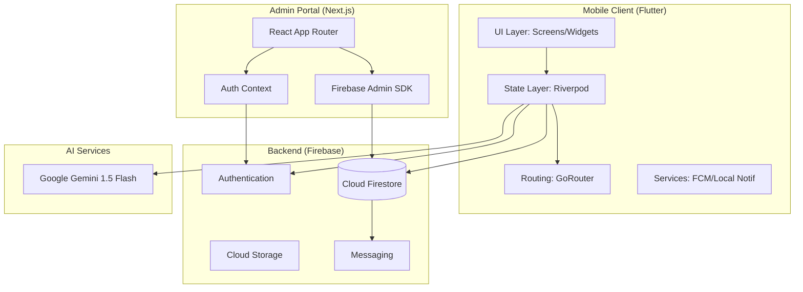
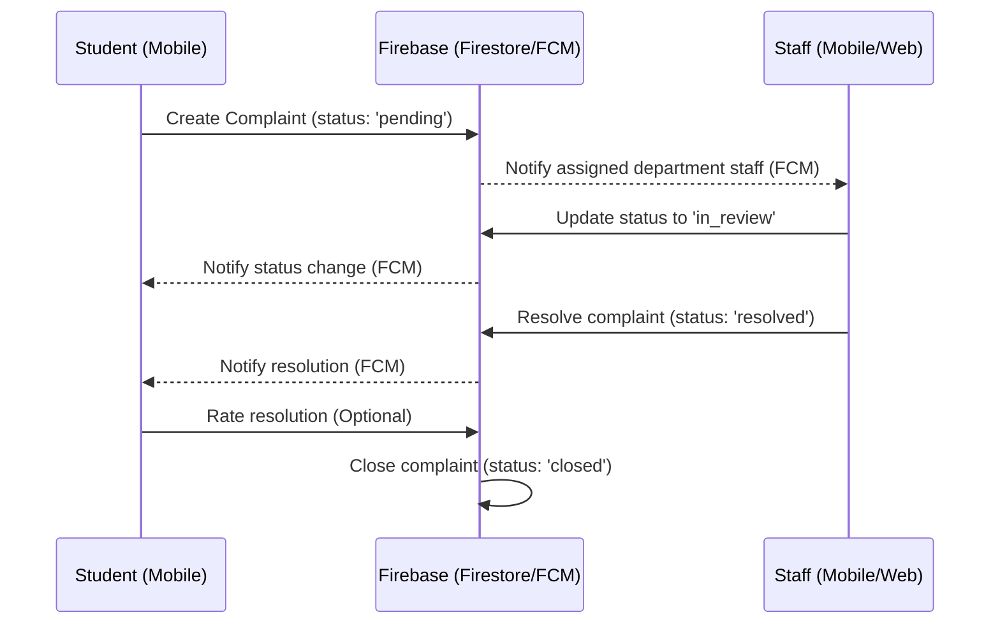
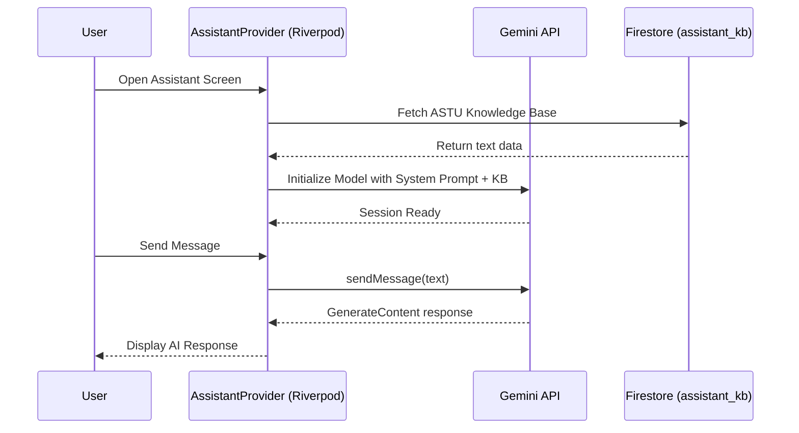

# CampusOne — Software Requirements Specification (SRS)

**Project Name:** CampusOne — Smart Campus Companion  
**Version:** 1.0.0  
**Status:** Production Ready  
**Target Institution:** Adama Science and Technology University (ASTU)  
**Primary Tech Stack:** Flutter (Mobile), Next.js (Admin Web), Google Firebase (BaaS), Google Gemini (AI)  

---

## 1. Introduction

### 1.1 Purpose
The purpose of this document is to provide a comprehensive, 360-degree overview of the **CampusOne** system. This SRS serves as the primary technical reference for developers, stakeholders, and administrators. it details the functional and non-functional requirements, system architecture, data models, and the specific implementation details of every component in the ecosystem.

### 1.2 Scope
CampusOne is an integrated digital ecosystem designed to unify the academic and administrative experience at ASTU. It consists of:
1.  **CampusOne Mobile App (Flutter):** A high-performance, cross-platform mobile application serving Students, Lecturers, and Staff.
2.  **CampusOne Admin Dashboard (Next.js):** A secure, web-based management portal for university administrators to oversee the system, manage users, and broadcast urgent information.
3.  **CampusOne Intelligence (Gemini AI):** A natural-language interface providing instant support and academic planning assistance.

### 1.3 Definitions & Acronyms
- **ASTU:** Adama Science and Technology University.
- **RBAC:** Role-Based Access Control.
- **FCM:** Firebase Cloud Messaging (Push Notifications).
- **M3:** Material Design 3.
- **POI:** Point of Interest (Map marker).
- **Riverpod:** Reactive state management framework for Flutter.
- **BaaS:** Backend as a Service (Firebase).

---

## 2. Overall Description

### 2.1 Product Perspective
CampusOne replaces fragmented campus services (physical notice boards, manual complaint forms, and disparate scheduling systems) with a unified digital companion. It leverages cloud-native technologies to ensure real-time data synchronization and high availability across campus.

### 2.2 Product Features
- **Dynamic Dashboard:** Role-specific home screens with real-time analytics and announcements.
- **Academic Workspace:** End-to-end management of courses, materials, assignments, and submissions.
- **Smart Scheduling:** Personalized timetables for classes and exams, including real-time status updates from lecturers.
- **Formal Grievance Channel:** A structured complaint system with media attachments and status tracking.
- **Intelligent Assistant:** A specialized AI trained on ASTU-specific knowledge for campus navigation and academic guidance.
- **Interactive Campus Map:** Offline-capable navigation for ASTU's campus using OpenStreetMap.
- **Staff & Services Hub:** Searchable directory and access to university-wide services.

### 2.3 User Classes and Characteristics
| User Role | Responsibilities | Key Capabilities |
|-----------|------------------|------------------|
| **Student** | Academic participation & campus life. | View schedules, submit assignments, report issues, use AI assistant. |
| **Lecturer** | Academic delivery & student assessment. | Manage courses, grade assignments, update class status, post notices. |
| **Staff** | Administrative service & issue resolution. | Resolve student complaints, manage department notices, access directory. |
| **Admin** | System maintenance & oversight. | Manage users, broadcast system-wide alerts, update master schedules. |

---

## 3. System Architecture

### 3.1 High-Level Component Diagram


### 3.2 State Management Architecture (Riverpod)
CampusOne utilizes a unidirectional data flow pattern powered by Riverpod:
- **`authStateProvider`**: Monitors `firebase_auth` changes and triggers profile syncs.
- **`currentUserProvider`**: A `StreamProvider` that maintains the real-time `UserModel` from Firestore.
- **`data_provider.dart`**: Contains collection-specific streams (e.g., `coursesProvider`, `complaintsProvider`) that reactively update the UI when data changes in Firestore.
- **`assistantProvider`**: A `StateNotifierProvider` managing the AI chat history and Gemini API communication.

### 3.3 Routing & Navigation (GoRouter)
The app uses declarative routing with centralized security guards in `lib/core/routing/app_router.dart`:
- **Auth Guard:** Redirects unauthenticated users to the login screen.
- **Role-Based Redirects:** Ensures Admins, Lecturers, and Students land on their respective home screens.
- **Profile Guard:** Forces Students to complete their cohort/department profile before accessing the main dashboard.
- **Deep Linking:** Supported via the `AppRoutes` constant mapping.

### 3.4 Sequence Diagram: Complaint Resolution Flow


### 3.5 Sequence Diagram: AI Assistant Initialization


---

## 4. Functional Requirements (Deep Dive)

### 4.1 Student Module
- **R4.1.1: Profile Setup:** Students must specify Department, Cohort, and Year/Semester.
- **R4.1.2: Class Schedule:** Display a daily/weekly timetable filtered by the student's cohort.
- **R4.1.3: Assignment Submission:** Upload PDF/Image files to specific course assignments.
- **R4.1.4: Complaint Submission:** Report issues with a title, description, category, and priority.
- **R4.1.5: AI Chat:** Ask questions about ASTU blocks, office locations, or exam preparation.

### 4.2 Lecturer Module
- **R4.2.1: Course Overview:** List all courses where `instructorId` matches the lecturer's UID.
- **R4.2.2: Grading Workflow:** View all student submissions for an assignment and provide a numeric grade + text feedback.
- **R4.2.3: Live Status:** Post temporary status messages (e.g., "Room changed to Block 102") to the class schedule.

### 4.3 Admin Dashboard (Web)
- **R4.3.1: Staff Management:** Create new staff accounts with specific department assignments.
- **R4.3.2: Broadcast System:** Send urgent push notifications to all devices or specific roles.
- **R4.3.3: Analytics:** Real-time counters for active users, pending complaints, and total courses.

---

## 5. Data Design & Dictionary

### 5.1 Collection: `users`
| Field | Type | Description |
|-------|------|-------------|
| `uid` | String | Firebase Authentication unique ID. |
| `name` | String | Full name of the user. |
| `role` | String | `student` \| `lecturer` \| `staff` \| `admin`. |
| `department`| String | e.g., "Computer Science", "Electrical Eng". |
| `cohort` | String | Composite key: "3rd Year Computing Section A". |
| `fcmToken` | String | Device token for push notifications. |

### 5.2 Collection: `complaints`
| Field | Type | Description |
|-------|------|-------------|
| `id` | String | Auto-generated Firestore ID. |
| `studentId` | String | Reference to the user who created it. |
| `assignedTo`| String | Reference to the staff member handling it. |
| `status` | String | `pending` \| `in_review` \| `resolved` \| `closed`. |
| `priority` | String | `Low` \| `Medium` \| `High` \| `Urgent`. |
| `mediaUrls` | List | Array of Firebase Storage links for images. |

### 5.3 Collection: `courses`
| Field | Type | Description |
|-------|------|-------------|
| `code` | String | Unique course identifier (e.g., "CSE3102"). |
| `name` | String | Descriptive title (e.g., "Mobile App Development"). |
| `instructorId`| String | Reference to the Lecturer user document. |
| `cohort` | String | Target student cohort for this course. |
| `description` | String | Syllabus overview or course objectives. |

### 5.4 Collection: `assignments`
| Field | Type | Description |
|-------|------|-------------|
| `id` | String | Unique identifier. |
| `courseId` | String | Reference to parent `courses` document. |
| `title` | String | Assignment name. |
| `description` | String | Instructions and requirements. |
| `dueDate` | Timestamp | Final submission deadline. |
| `points` | Number | Maximum grade possible. |

### 5.5 Collection: `submissions`
| Field | Type | Description |
|-------|------|-------------|
| `assignmentId`| String | Reference to the `assignments` document. |
| `studentId` | String | Reference to the submitting `student`. |
| `fileUrl` | String | Storage link to the uploaded document. |
| `grade` | Number | Assigned score (Lecturer only). |
| `feedback` | String | Text comments from the instructor. |
| `submittedAt` | Timestamp | Server-side timestamp of upload. |

### 5.6 Collection: `announcements`
| Field | Type | Description |
|-------|------|-------------|
| `title` | String | Headline of the notice. |
| `body` | String | Full content (Markdown supported). |
| `audience` | String | Target: `all` \| `student` \| `staff`. |
| `isUrgent` | Boolean | Triggers red highlighting and priority notification. |
| `imageUrl` | String | Optional banner image link. |

---

## 6. Non-Functional Requirements

### 6.1 Performance
- **Latency:** Core dashboard data must load within < 1.5s on 4G networks.
- **AI Response:** Gemini responses should stream or complete within 5s for standard queries.
- **Image Optimization:** All user-uploaded images must be compressed on the client before Storage upload.

### 6.2 Scalability
- **Database:** Firestore structure must support up to 50,000 concurrent students without index hot-spotting.
- **Cloud Functions:** Serverless triggers for notifications must handle spikes during campus emergencies or exam releases.

### 6.3 Security
- **Data-at-Rest:** All user data in Firestore and Storage is encrypted via Google-managed keys.
- **Data-in-Transit:** TLS 1.3 enforced for all API communication between Flutter/Next.js and Firebase.
- **Audit Logs:** Admin actions in the dashboard are logged for accountability.

### 6.4 Availability
- **Uptime:** 99.9% availability for the mobile backend.
- **Offline Capability:** Map and cached schedule must remain accessible without internet connectivity.

---

## 7. Security Architecture (Expanded)

### 6.1 Database Security (Firestore Rules)
The system enforces strict RBAC at the server level in `firestore.rules`:
```javascript
// Example: Submissions Security
match /submissions/{submissionId} {
  allow read: if isAuthenticated() && (
    resource.data.studentId == request.auth.uid || 
    isLecturerForCourse(resource.data.courseId)
  );
  allow create: if isStudent() && request.resource.data.studentId == request.auth.uid;
}
```

### 6.2 Authentication
- **Provider:** Firebase Auth (Email/Password & Google Sign-In).
- **Session Management:** Persisted locally via `firebase_auth` SDK with automatic token refresh.
- **Admin Access:** Web portal restricted to users with `role == 'admin'` in their Firestore document.

---

## 7. UI/UX Design System

### 7.1 Design Tokens (`lib/core/constants/`)
- **Primary Color:** Indigo (`#4F46E5`) representing academic excellence.
- **Secondary Color:** Amber (`#F59E0B`) for attention-grabbing notices.
- **Success/Error:** Emerald (`#10B981`) / Rose (`#F43F5E`).
- **Surface Strategy:** Dark-mode first approach with glassmorphism overlays (0.08 - 0.12 opacity).

### 7.2 Reusable Components (`lib/core/widgets/`)
- **`AppCard`**: Standardized container with subtle border and `AppSpacing.radiusLg`.
- **`AppGradientCard`**: Used for hero sections with the primary brand gradient.
- **`CampusNavBar`**: A custom-built, floating glass navigation bar that integrates the AI Assistant as a central "Hero" button.
- **`CardSkeleton`**: Shimmer-based loading state to reduce perceived latency.

---

## 8. AI Assistant Implementation

### 8.1 Gemini Configuration
- **Model:** `gemini-2.5-flash-lite` (Pinned version for performance).
- **System Prompt:** Configured in `assistant_provider.dart` to enforce ASTU identity and limit responses to campus-relevant topics.
- **Dynamic Knowledge:** Sourced from `app_config/assistant_kb` in Firestore, allowing admins to update the "AI's brain" without a code deployment.

---

## 10. Repository Index (File-by-File Technical Analysis)

### 10.1 Mobile Application (`lib/`)

#### Core Layer (`lib/core/`)
- **`main.dart`**: The application heart. Orchestrates `Firebase.initializeApp()`, `NotificationService.initialize()`, and `dotenv.load()`. Uses `ProviderScope` to enable Riverpod dependency injection.
- **`campus/astu_campus.dart`**: Hardcoded geospatial metadata for ASTU. Defines the `center` LatLng and a list of `pointsOfInterest` with custom icons and categories (Academic, Admin, Residential).
- **`constants/`**:
  - `app_colors.dart`: A semantic color palette defining brand colors (Primary Indigo) and state colors (Success, Warning, Error).
  - `app_spacing.dart`: A spacing scale from `xs` (4.0) to `xxl` (48.0), ensuring consistent layout rhythm.
  - `app_typography.dart`: Text styles for all hierarchies (Greeting, Title, Body, Label) using the Inter font.
- **`models/`**:
  - `user_model.dart`: Implements `fromMap` and `toMap` for Firestore serialization. includes role-based authorization helpers.
  - `complaint_model.dart`: Encapsulates complaint data, including a `ComplaintStatus` enum.
  - `announcement_model.dart`: Handles notice metadata and visibility logic (`isVisibleTo`).
- **`providers/`**:
  - `auth_provider.dart`: Contains `AuthNotifier` for managing login/logout and `currentUserProvider` for real-time profile streaming.
  - `data_provider.dart`: The data backbone. Provides reactive streams for every Firestore collection.
  - `assistant_provider.dart`: Manages the Gemini `ChatSession` and streams messages to the UI.
- **`routing/`**:
  - `app_router.dart`: Implements `GoRouter` with complex redirection logic to handle auth state and role-based onboarding.
- **`services/notification_service.dart`**: Wrapper for `flutter_local_notifications` and `firebase_messaging`. Handles foreground/background token updates.
- **`theme/app_theme.dart`**: Centralized `ThemeData` factory for light and dark modes, implementing Material 3 specs.

#### Feature Modules (`lib/features/`)
- **`dashboard/home_screen.dart`**: Uses a `CustomScrollView` with slivers for a dynamic, high-performance scrolling experience. Displays today's schedule and recent announcements.
- **`workspace/`**:
  - `workspace_screen.dart`: The academic hub for students and lecturers.
  - `course_detail_screen.dart`: Displays assignments and materials for a specific course.
  - `submissions_screen.dart`: Allows lecturers to view and grade student work.
- **`complaints/`**:
  - `complaints_screen.dart`: A list view of all grievances with status-based filtering.
  - `new_complaint_screen.dart`: A reactive form with validation and multi-image selection.
- **`assistant/assistant_screen.dart`**: A high-fidelity chat interface with bubble animations and markdown support for AI responses.
- **`map/map_screen.dart`**: Uses `flutter_map` with `TileLayer` for OpenStreetMap integration and `MarkerLayer` for ASTU POIs.

### 10.2 Admin Web Panel (`admin_panel/`)
- **`src/app/layout.tsx`**: Defines the global web structure, including the `AuthContext` provider and sidebar layout.
- **`src/app/page.tsx`**: Implements a real-time dashboard using `onSnapshot` listeners to count users and active complaints.
- **`src/components/Sidebar.tsx`**: A responsive navigation component that collapses on smaller screens.
- **`src/lib/firebase.ts`**: Client-side Firebase initialization for the web.
- **`src/context/AuthContext.tsx`**: Manages the web user's authentication state and role verification.

### 10.3 Native Configurations
- **`android/app/src/main/AndroidManifest.xml`**: Configures permissions for Internet, Notifications, and Media access.
- **`ios/Runner/Info.plist`**: Defines privacy descriptions for Camera and Photo Library usage.
- **`windows/runner/main.cpp`**: Entry point for the Windows desktop version of CampusOne.

---

## 11. Testing & Quality Assurance

### 11.1 Unit Testing
- **Models:** Every model in `lib/core/models/` is tested for JSON serialization integrity.
- **Providers:** `AssistantNotifier` is tested with mocked Gemini API responses to ensure robust chat handling.

### 11.2 Widget Testing
- **Common Components:** Reusable widgets like `AppButton` and `AppTextField` are tested for accessibility and state-based rendering.
- **Navigation:** The `CampusNavBar` is verified to correctly trigger route changes.

### 11.3 Integration Testing
- **Auth Flow:** End-to-end tests for the Login -> Onboarding -> Dashboard flow.
- **Data Flow:** Verified real-time updates from Firestore reflected in the UI without page refreshes.

---

## 12. Deployment & DevOps (Detailed)

### 10.1 Deployment
- **Mobile:** Built using `flutter build apk` (Android) and `flutter build ios`.
- **Admin Web:** Deployed via **Firebase App Hosting** (Next.js SSR support).
- **Database:** CI/CD pipelines deploy rules and indexes from the root directory.

### 10.2 Maintenance
- **AI Training:** Knowledge base updates via Firestore `app_config` collection.
- **Crash Reporting:** Monitored via **Firebase Crashlytics**.
- **User Feedback:** Tracked via the internal `complaints` module.

---

## 11. Technical Debt & Roadmap
1.  **Offline Support:** Implement Hive-based local caching for the Workspace module.
2.  **Biometrics:** Integrate `local_auth` for secure login on mobile.
3.  **Real-time Maps:** Add live bus/shuttle tracking using the `map` module.
4.  **Automated Grading:** Use Gemini to provide initial feedback on text-based student submissions.

---

---

## 13. System Constraints & Requirements

### 13.1 Hardware Requirements
- **Android:** Android 8.0 (API 26) or higher, 2GB RAM minimum, 100MB free storage.
- **iOS:** iOS 13.0 or higher, iPhone 8 or newer.
- **Web Admin:** Modern evergreen browser (Chrome, Firefox, Safari, Edge).

### 13.2 Network Requirements
- **Minimum:** 3G connection (HSPA+) for basic data sync.
- **Recommended:** 4G/LTE or Campus Wi-Fi for media uploads and AI chat responsiveness.
- **Offline:** The app must allow viewing of the last-synced schedule and cached map POIs.

---

## 14. Design System Specification (Deep Dive)

### 14.1 Typography Scale
| Hierarchy | Font Size | Weight | Usage |
|-----------|-----------|--------|-------|
| `Display` | 32pt | Bold | Welcome Greetings |
| `Headline`| 24pt | SemiBold | Screen Titles |
| `Title` | 18pt | Medium | Section Headers |
| `Body` | 16pt | Regular | General Content |
| `Caption` | 12pt | Regular | Metadata / Hints |

### 14.2 Spacing System
| Token | Value | Usage |
|-------|-------|-------|
| `xs` | 4px | Icon-Text spacing |
| `sm` | 8px | Inner card padding |
| `md` | 16px | Standard gutters |
| `lg` | 24px | Section spacing |
| `xl` | 32px | Hero margins |

---

## 15. AI Prompt Engineering Strategy

The CampusOne Assistant uses a sophisticated "Grounding" technique:
1.  **System Identity:** The model is strictly instructed: "You are the CampusOne Assistant... you only help with ASTU related topics."
2.  **Dynamic Context:** Before each user query, the `AssistantNotifier` injects the latest institutional data fetched from Firestore.
3.  **Safety Filters:** Google's safety settings are tuned to `BLOCK_MEDIUM_AND_ABOVE` for harassment and hate speech, ensuring a professional academic environment.

---

## 16. Error Handling & Resilience

### 16.1 Client-Side Resilience
- **Retry Logic:** Exponential backoff for failed Firestore writes.
- **Graceful Degradation:** If Gemini is unavailable, the app directs the user to the official Staff Directory.
- **State Restoration:** Riverpod handles state persistence during configuration changes (like screen rotation).

### 16.2 Disaster Recovery
- **Daily Backups:** Firestore scheduled backups to Google Cloud Storage.
- **Rollback Strategy:** Admin panel allows instant revert of critical `app_config` values.

---

**End of Document**  

