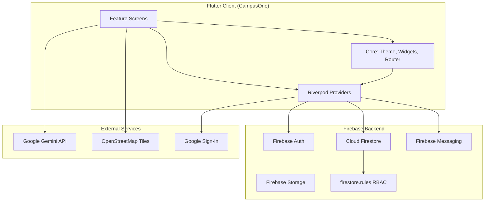
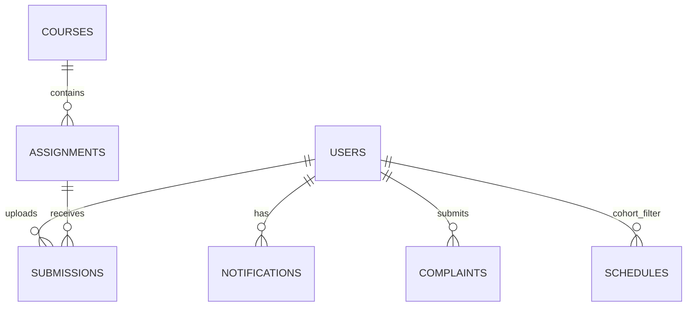
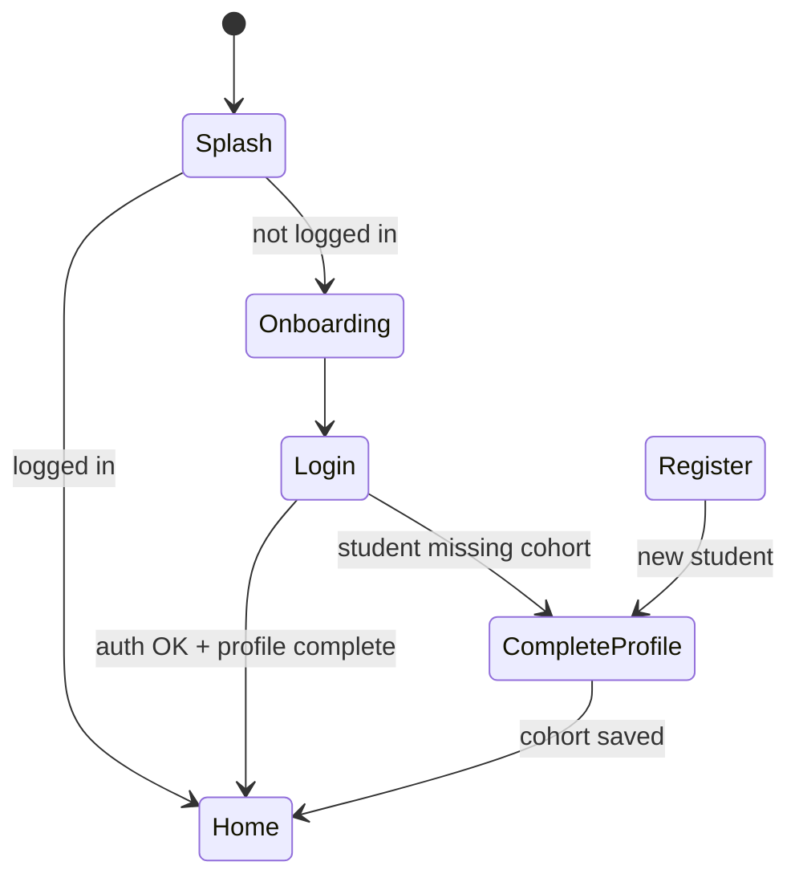
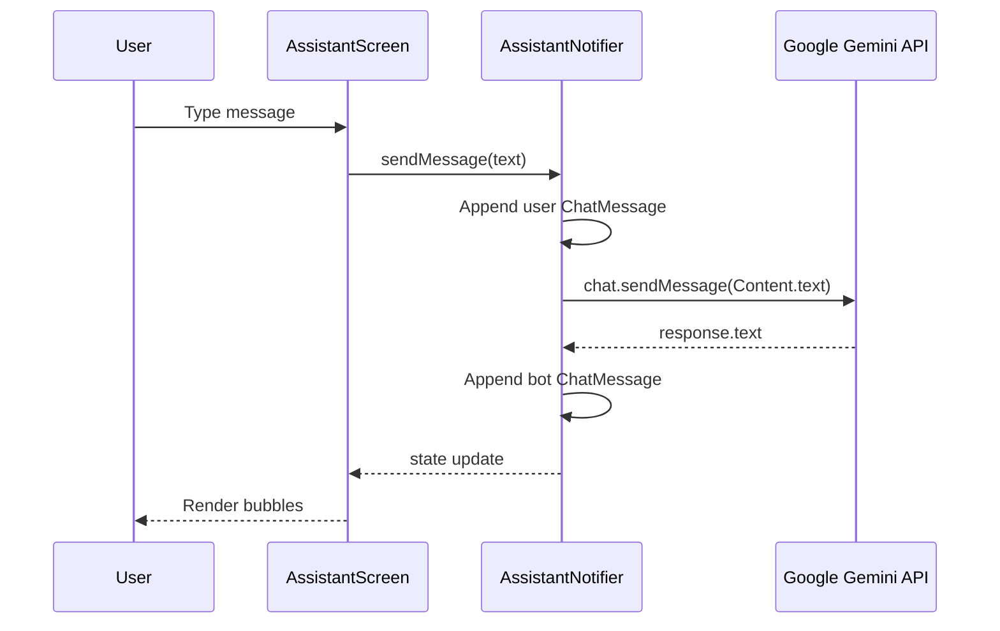

# CampusOne — Software Requirements & System Architecture Documentation

**Document type:** Software Requirements Specification (SRS) / Technical Architecture Reference  
**Product:** CampusOne — Smart Campus Companion  
**Version:** 1.0.0+1  
**Platform:** Flutter (Android / iOS / Web-capable)  
**Backend:** Google Firebase (Auth, Firestore, Storage, Messaging, Analytics, Crashlytics)  
**AI:** Google Gemini (`google_generative_ai`)  

---

## Table of Contents

1. [Executive Summary](#1-executive-summary)
2. [System Context & Stakeholders](#2-system-context--stakeholders)
3. [High-Level Architecture](#3-high-level-architecture)
4. [Technology Stack](#4-technology-stack)
5. [Repository Structure](#5-repository-structure)
6. [Application Bootstrap & Lifecycle](#6-application-bootstrap--lifecycle)
7. [Layered Architecture (Core)](#7-layered-architecture-core)
8. [Feature Modules (Presentation)](#8-feature-modules-presentation)
9. [Data Layer — Models & Firestore Schema](#9-data-layer--models--firestore-schema)
10. [State Management (Riverpod)](#10-state-management-riverpod)
11. [Navigation & Routing](#11-navigation--routing)
12. [Authentication & Role-Based Access](#12-authentication--role-based-access)
13. [Security Architecture](#13-security-architecture)
14. [AI Assistant Architecture](#14-ai-assistant-architecture)
15. [UI/UX Design System](#15-uiux-design-system)
16. [Notifications & Messaging](#16-notifications--messaging)
17. [Firebase Backend Configuration](#17-firebase-backend-configuration)
18. [Platform & Build Files](#18-platform--build-files)
19. [Operational Setup](#19-operational-setup)
20. [Known Limitations & Technical Debt](#20-known-limitations--technical-debt)
21. [Appendix — Complete File Index](#21-appendix--complete-file-index)

---

## 1. Executive Summary

CampusOne is a production-oriented Flutter mobile application that unifies campus operations for university students and staff. It provides:

- Personalized dashboards with announcements and quick actions
- Complaint submission and lifecycle tracking
- Course and schedule data must be filtered by Section (1-6) and Group (1-6).
- `cohort` field format: `Year Department` (e.g. `2nd Year Software Engineering`).
- Section and Group are separate fields in the documents.
- Academic workspace (courses, assignments, submissions)
- Interactive campus map (OpenStreetMap)
- Staff directory and services hub
- Push notifications via Firebase Cloud Messaging (FCM)
- An AI campus assistant powered by **Google Gemini 1.5 Flash**

The codebase follows a **feature-first folder layout** with a shared **`lib/core`** layer for design tokens, routing, providers, models, and reusable widgets. State is managed with **Flutter Riverpod**. Navigation uses **GoRouter** with auth-aware redirects and a role-specific bottom navigation shell.

---

## 2. System Context & Stakeholders

| Actor | Role in system | Primary capabilities |
|-------|----------------|----------------------|
| **Student** | `UserRole.student` | Home, schedule, workspace, complaints, profile; must complete cohort profile |
| **Staff** | `UserRole.staff` | Staff portal home, announcements, assigned complaints, profile |
| **Administrator** | `UserRole.admin` | Full Firestore write access; admin dashboard analytics |
| **Firebase** | Backend platform | Auth, real-time DB, storage, push, analytics |
| **Gemini API** | External AI service | Conversational assistant (client-side SDK) |

**External integrations:**

- Google Sign-In (OAuth)
- OpenStreetMap tile server (campus map)
- Google Generative AI API (Gemini)

---

## 3. High-Level Architecture



### Architectural layers

| Layer | Location | Responsibility |
|-------|----------|----------------|
| **Presentation** | `lib/features/**` | Screens, forms, user flows |
| **Application / State** | `lib/core/providers/**` | Riverpod streams, notifiers, data services |
| **Domain / Models** | `lib/core/models/**` | Serializable entities, enums |
| **Infrastructure** | Firebase SDKs, `.env`, platform configs | Persistence, auth, push |
| **Design System** | `lib/core/constants/**`, `lib/core/theme/**`, `lib/core/widgets/**` | Visual consistency |

---

## 4. Technology Stack

| Category | Package / Service | Purpose |
|----------|-------------------|---------|
| Framework | Flutter SDK ≥3.3 | Cross-platform UI |
| State | `flutter_riverpod`, `riverpod_annotation` | Reactive app state |
| Navigation | `go_router` | Declarative routing + redirects |
| Backend | `firebase_core`, `firebase_auth`, `cloud_firestore`, `firebase_storage`, `firebase_messaging`, `firebase_analytics`, `firebase_crashlytics` | BaaS |
| Auth | `google_sign_in` | OAuth sign-in |
| AI | `google_generative_ai` | Gemini chat |
| Config | `flutter_dotenv` | `GEMINI_API_KEY` from `.env` |
| Maps | `flutter_map`, `latlong2` | Campus map |
| UI polish | `flutter_animate`, `lottie`, `shimmer`, `cached_network_image`, `fl_chart` | Motion, loading, charts |
| Local storage | `hive_flutter`, `shared_preferences`, `flutter_secure_storage` | Cache / secrets (declared; selective use) |
| Media | `image_picker`, `file_picker`, `permission_handler` | Complaint attachments |
| Biometrics | `local_auth` | Declared for future/local auth flows |
| Fonts | `google_fonts` | Inter / design typography |

---

## 5. Repository Structure

```
CampusOne/
├── lib/                          # Application source (primary)
│   ├── main.dart                 # Entry point
│   ├── core/                     # Shared infrastructure
│   │   ├── constants/            # Design tokens
│   │   ├── models/               # Firestore entity models
│   │   ├── providers/            # Riverpod state
│   │   ├── routing/              # GoRouter config
│   │   ├── services/             # Notification service
│   │   ├── theme/                # Material 3 themes
│   │   └── widgets/              # Reusable UI components
│   └── features/                 # Feature modules (screens)
├── assets/                       # images, icons, animations
├── android/                      # Android native shell
├── ios/                          # iOS native shell
├── test/                         # Unit/widget tests
├── admin_panel/                  # Firebase Hosting web admin (referenced)
├── firebase.json                 # Firebase project config
├── firestore.rules               # Server-side security rules
├── firestore.indexes.json        # Composite query indexes
├── pubspec.yaml                  # Dependencies & assets
├── analysis_options.yaml         # Dart analyzer / lints
├── README.md                     # Quick start
└── docs/
    └── SRS_DOCUMENTATION.md      # This document
```

---

## 6. Application Bootstrap & Lifecycle

### File: `lib/main.dart`

**Purpose:** Application entry point and global initialization.

**Execution order:**

1. `WidgetsFlutterBinding.ensureInitialized()` — required before async plugin setup.
2. **`.env` load** via `flutter_dotenv` — supplies `GEMINI_API_KEY` (graceful failure if missing).
3. **Orientation lock** — portrait only (`portraitUp`, `portraitDown`).
4. **System UI** — transparent status bar.
5. **Firebase.initializeApp()** — core backend; registers FCM background handler.
6. **NotificationService.initialize()** — local notifications + FCM foreground listener.
7. **`runApp(ProviderScope(child: CampusOneApp()))`** — Riverpod root scope.

**`CampusOneApp` (ConsumerWidget):**

- Watches `appRouterProvider` for `MaterialApp.router`.
- Applies `AppTheme.light` / `AppTheme.dark` with `ThemeMode.system`.
- Listens to `authStateProvider`; on login, calls `NotificationService.updateToken(uid)` to persist FCM token in Firestore.

**Logic pattern:** Fail-soft initialization (Firebase/dotenv errors are logged, app still launches).

---

## 7. Layered Architecture (Core)

### 7.1 Design Constants

#### `lib/core/constants/constants.dart`

Barrel export for the design system:

```dart
export 'app_colors.dart';
export 'app_spacing.dart';
export 'app_typography.dart';
```

#### `lib/core/constants/app_colors.dart`

**Purpose:** Single source of truth for brand and semantic colors.

**Rules enforced:**

- Material Design 3 palette with seed `primary600` (`#1565C0`)
- **60-30-10 color rule** (documented in file header)
- WCAG AA contrast targets (≥4.5:1) for text pairs
- Semantic colors: `success`, `warning`, `error`, surfaces for light/dark
- Gradients: `primaryGradient`, `heroGradient` for marketing/splash UI

#### `lib/core/constants/app_spacing.dart`

**Purpose:** Layout rhythm on an **8dp grid**.

| Token | Value | Usage |
|-------|-------|-------|
| `micro` | 4 | Fine gaps |
| `xs`–`xxl` | 8–48 | Standard spacing scale |
| `screenPadding` | 16 | Screen horizontal padding |
| `buttonHeight` | 52 | Primary CTAs |
| `minTouchTarget` | 48 | WCAG minimum touch area |
| `radiusMd` | 12 | Cards, inputs |
| `bottomNavHeight` | 72 | Navigation bar |

#### `lib/core/constants/app_typography.dart`

**Purpose:** Type scale aligned with Material 3 `TextTheme` roles (`displayLarge` through `labelSmall`). Uses **Google Fonts** (typically Inter) for consistent rendering across platforms.

---

### 7.2 Theme

#### `lib/core/theme/app_theme.dart`

**Purpose:** Builds `ThemeData` for light and dark modes.

**Logic:**

- `ColorScheme.fromSeed(seedColor: primary600)` with explicit overrides per brightness.
- Central `_buildTheme()` configures:
  - AppBar (zero elevation, transparent status bar handling)
  - Cards (bordered, no shadow — flat elevated surfaces)
  - Inputs (filled, focused 2px primary border)
  - Buttons (full-width elevated/outlined, 52px height)
  - Chips, dialogs, bottom sheets, snackbars, list tiles, switches
- `useMaterial3: true` globally.

**Usage:** Referenced once in `main.dart` as `theme` and `darkTheme`.

---

### 7.3 Reusable Widgets (`lib/core/widgets/`)

| File | Component | Behavior |
|------|-----------|----------|
| `app_button.dart` | `AppPrimaryButton`, `AppSecondaryButton` | Branded CTAs using design tokens |
| `app_text_field.dart` | `AppTextField` | Validated inputs with consistent decoration |
| `app_card.dart` | `AppCard` | Tappable card container with optional padding |
| `app_chips.dart` | `StatusChip`, category chips | Status/category visual encoding |
| `app_states.dart` | `EmptyState`, `ErrorState` | Standard empty/error UX |
| `loading_skeleton.dart` | `LoadingSkeleton` | Shimmer-style placeholder loading |
| `widgets.dart` | Barrel export | Single import for features |

**UI rule:** Features should import `widgets.dart` + `constants.dart` rather than duplicating styles.

---

### 7.4 Domain Models (`lib/core/models/`)

#### `user_model.dart`

| Field | Type | Description |
|-------|------|-------------|
| `uid`, `name`, `email` | String | Identity |
| `role` | `UserRole` | `student`, `staff`, `admin` |
| `cohort` | String? | e.g. `"3rd Year (1st Sem) - Group B"` — gates schedule/workspace |
| `yearSemester`, `studentGroup` | String? | Decomposed cohort fields |
| `department`, `studentId`, `photoUrl` | String? | Profile metadata |
| `fcmToken` | String? | Push notification target |
| `isActive` | bool | Account flag (rules reference; client uses for future gating) |

**Computed:** `initials`, `isAdmin`, `isStaff`, `isStudent`.

#### `complaint_model.dart`

Tracks grievances with `ComplaintStatus` enum (`pending`, `in_review`, `resolved`, `closed`), media URLs, priority, optional rating, `studentId`, `assignedTo`.

**Serialization:** Firestore `Timestamp` for dates; `FieldValue.serverTimestamp()` on write.

#### `announcement_model.dart`

Campus notices with pinning, urgency, department scoping, expiry.

#### `notification_model.dart`

Per-user inbox documents under `users/{uid}/notifications`.

---

### 7.5 Providers (`lib/core/providers/`)

#### `auth_provider.dart`

| Provider | Type | Logic |
|----------|------|-------|
| `firebaseAuthProvider` | `Provider<FirebaseAuth>` | Singleton auth instance |
| `firestoreProvider` | `Provider<FirebaseFirestore>` | Firestore instance |
| `authStateProvider` | `StreamProvider<User?>` | `authStateChanges()` stream |
| `currentUserProvider` | `StreamProvider<UserModel?>` | Live profile from `users/{uid}` |
| `authNotifierProvider` | `NotifierProvider<AuthNotifier>` | Imperative auth actions |

**`AuthNotifier` methods:**

- `signInWithEmail` — email/password via Firebase Auth
- `signInWithGoogle` — OAuth; auto-creates Firestore user doc if first login (default role: student)
- `registerWithEmail` — creates Auth user + Firestore profile with selected role
- `sendPasswordReset` — Firebase reset email
- `signOut` — terminates session

#### `data_provider.dart`

Central **read streams** and **write service**:

| Provider | Query logic |
|----------|-------------|
| `complaintsProvider` | Students: `studentId == uid`; Staff: `assignedTo == uid` |
| `complaintDetailProvider` | Family provider by complaint ID |
| `announcementsProvider` | All authenticated users; ordered pinned first |
| `notificationsProvider` | Subcollection under current user |
| `scheduleProvider` | `cohort == userProfile.cohort` |
| `examScheduleProvider` | `yearSemester` match, latest document |
| `staffProvider` | Full staff directory |
| `coursesProvider` | Students by cohort; staff by `instructorId` |
| `assignmentsProvider` | Per `courseId` |
| `submissionsProvider` | Per `assignmentId`; students filtered to own |

**`DataService` writes:**

- `submitComplaint`, `updateComplaintStatus`
- `markNotificationAsRead`, `markAllNotificationsAsRead`
- `postClassStatusMessage` — staff/instructor live class status on schedule docs

**Embedded models in same file:** `ScheduleItem`, `CourseModel`, `AssignmentModel`, `SubmissionModel`, `StaffModel` (kept colocated with providers for rapid development).

#### `assistant_provider.dart`

| Element | Description |
|---------|-------------|
| `ChatMessage` | `text`, `isUser`, `time` |
| `AssistantNotifier` | `StateNotifier<List<ChatMessage>>` |
| `init(apiKey)` | Configures `GenerativeModel` with system instruction |
| `sendMessage` | Appends user bubble, calls `_chat.sendMessage`, appends AI reply or error |
| `clearChat` | Resets history and starts new `ChatSession` |

---

### 7.6 Routing

#### `lib/core/routing/app_router.dart`

**`AppRoutes`** — canonical path constants.

**`appRouterProvider`:**

- `refreshListenable: GoRouterRefreshStream` — rebuilds on auth/profile changes.
- **Redirect guard:**
  - Unauthenticated users → `/login` (except splash, onboarding, register, forgot password).
  - Students without `cohort` → `/complete-profile`.
  - Logged-in users on auth routes → role-specific home (`/staff` for staff, else `/home`).
- **`ShellRoute`** — bottom navigation wrapper (`AppShell`) for main tabs.
- **FAB** — center-docked assistant button → `/assistant`.

**Role-specific tabs:**

| Role | Tab routes |
|------|------------|
| Student | home, schedule, workspace, complaints, profile |
| Staff | home, announcements, complaints, profile |

---

### 7.7 Services

#### `lib/core/services/notification_service.dart`

| Method | Behavior |
|--------|----------|
| `initialize()` | Android local notifications plugin; requests FCM permission; listens `FirebaseMessaging.onMessage` |
| `updateToken(uid)` | Writes `fcmToken` to user doc; subscribes to topic `all` |
| `showNotification(message)` | Displays high-priority Android notification |

---

## 8. Feature Modules (Presentation)

Each feature is a **screen** (or small screen group) under `lib/features/<name>/`.

### 8.1 Authentication (`lib/features/auth/`)

| File | Route | Function |
|------|-------|----------|
| `splash_screen.dart` | `/` | Animated brand splash; routes to `/home` or `/onboarding` |
| `onboarding_screen.dart` | `/onboarding` | First-run marketing slides |
| `login_screen.dart` | `/login` | Email/password + Google sign-in; form validation |
| `register_screen.dart` | `/register` | Account creation with role selection |
| `forgot_password_screen.dart` | `/forgot-password` | Password reset email |
| `complete_profile_screen.dart` | `/complete-profile` | **Mandatory** student cohort selection (year/semester + group) written to Firestore |

**Security note:** Profile completion only updates allowed fields (`cohort`, `yearSemester`, `studentGroup`) — aligned with Firestore rules blocking `role` changes by users.

---

### 8.2 Dashboard (`lib/features/dashboard/home_screen.dart`)

**Logic:**

- Branches on `UserRole`: `_StudentHomeScreen` vs `_StaffHomeScreen`.
- Student view: greeting by time-of-day, quick action grid (complaints, map, library, etc.), announcement preview, AI banner.
- Pull-to-refresh invalidates `currentUserProvider` and `announcementsProvider`.
- Uses hard-coded service routes via `AppRoutes`.

---

### 8.3 Schedule (`lib/features/schedule/`)

| File | Purpose |
|------|---------|
| `schedule_screen.dart` | Weekly class timetable from `scheduleProvider` (cohort-filtered) |
| `exam_schedule_screen.dart` | Reads `examScheduleProvider` for batch exam tables |

**Data logic:** Schedule documents include `dayIndex`, times, room, instructor; optional `statusMessage` / `statusExpiresAt` for live updates (staff can update per rules).

---

### 8.4 Complaints (`lib/features/complaints/`)

| File | Route | Function |
|------|-------|----------|
| `complaints_screen.dart` | `/complaints` | List with status chips; role-filtered stream |
| `new_complaint_screen.dart` | `/complaints/new` | Multi-step form: category, priority, description, image picker |
| `complaint_detail_screen.dart` | `/complaints/:id` | Detail view; staff may update status via `DataService` |

**Media upload logic:** Images are picked locally; upload to Firebase Storage is **mocked** (placeholder URLs + user snackbar). Production path requires Blaze plan + Storage rules.

---

### 8.5 Academic Workspace (`lib/features/workspace/`)

| File | Function |
|------|----------|
| `workspace_screen.dart` | Lists `coursesProvider` cards; navigates to detail |
| `course_detail_screen.dart` | Assignments list (`assignmentsProvider`), submissions |

**Access control:** Enforced server-side in `firestore.rules` (instructor owns course; students own submissions).

---

### 8.6 Announcements (`lib/features/announcements/`)

| File | Function |
|------|----------|
| `announcements_screen.dart` | Feed with pin/urgent styling |
| `announcement_detail_screen.dart` | Full body content |

**Write access:** Staff and admin per Firestore rules.

---

### 8.7 AI Assistant (`lib/features/assistant/assistant_screen.dart`)

**Initialization:** Post-frame callback loads `dotenv.env['GEMINI_API_KEY']` and calls `assistantProvider.notifier.init(apiKey)`.

**UI:**

- Chat bubbles (user vs assistant)
- Typing indicator during `sendMessage`
- Clear chat action (resets session)
- Welcome view when empty

**Model config:** `gemini-1.5-flash` with campus-specific system instruction (see [§14](#14-ai-assistant-architecture)).

---

### 8.8 Campus Map (`lib/features/map/map_screen.dart`)

**Logic:**

- `flutter_map` + OpenStreetMap raster tiles.
- Static `LatLng` markers for ASTU campus buildings (hard-coded POI list).
- Search field (UI present; filter logic minimal).
- No backend — fully client-side.

---

### 8.9 Staff Portal (`lib/features/staff/staff_screen.dart`)

Dedicated staff dashboard (separate from student shell home). Quick links to tasks, announcements, notifications.

---

### 8.10 Admin (`lib/features/admin/admin_screen.dart`)

**Route:** `/admin` (full-screen, outside shell).

**Logic:**

- Aggregates `complaintsProvider` and `announcementsProvider` for stat cards.
- Recent activity list.
- Placeholder actions (e.g. post announcement — UI stub).

**Note:** Route is not role-guarded in router; protection relies on Firestore rules for writes and UI discoverability.

---

### 8.11 Supporting Features

| Module | File(s) | Description |
|--------|---------|-------------|
| **Profile** | `profile_screen.dart` | Account info, preferences placeholders, sign out |
| **Notifications** | `notifications_screen.dart` | In-app notification center |
| **Directory** | `directory_screen.dart` | Staff/contact search |
| **Staff list** | `staff_screen.dart` in `features/staff` vs directory — staff portal vs directory feature |
| **Library** | `library_screen.dart` | Library services UI |
| **E-Learning** | `elearning_screen.dart` | E-learning hub placeholder/integration |
| **Services** | `services_screen.dart` | Campus services menu |

---

## 9. Data Layer — Models & Firestore Schema

### Collections (inferred from providers + rules)

| Collection | Document key | Primary consumers |
|------------|--------------|-------------------|
| `users` | `uid` | Auth, profile, FCM token |
| `users/{uid}/notifications` | auto | Notification center |
| `complaints` | auto | Complaint module |
| `announcements` | auto | Home, announcements |
| `schedules` | auto | Schedule screen |
| `exam_schedules` | auto | Exam schedule |
| `staff` | auto | Directory |
| `courses` | auto | Workspace |
| `assignments` | auto | Course detail |
| `submissions` | auto | Assignment submissions |

### Key relationships



---

## 10. State Management (Riverpod)

**Pattern summary:**

| Pattern | Usage |
|---------|-------|
| `StreamProvider` | Firebase Auth + Firestore real-time listeners |
| `StreamProvider.family` | Parameterized detail streams (complaint ID, course ID) |
| `NotifierProvider` | Auth actions, async loading/error states |
| `StateNotifierProvider` | Ephemeral AI chat history |
| `Provider` | `DataService`, Firebase singletons |

**Invalidation:** Screens call `ref.invalidate(provider)` on pull-to-refresh.

**No code generation in runtime path:** `riverpod_annotation` / `build_runner` are dev dependencies for optional codegen; current providers are hand-written.

---

## 11. Navigation & Routing

### Auth flow diagram



### Shell vs full-screen routes

- **Inside shell:** home, schedule, workspace, complaints, profile (+ nested announcement detail).
- **Outside shell:** new complaint, complaint detail, map, assistant, admin, notifications, directory, library, services.

---

## 12. Authentication & Role-Based Access

### Client-side

- Firebase Auth session drives `authStateProvider`.
- Firestore profile drives feature queries (cohort, role, instructor ID).
- GoRouter redirects enforce login and cohort completion.

### Server-side (`firestore.rules`)

| Function | Rule |
|----------|------|
| `isAuthenticated()` | `request.auth != null` |
| `isAdmin()` | User doc `role == 'admin'` OR email matches `.*admin.*` |
| `isStaff()` | User doc `role == 'staff'` |
| User updates | Cannot change `role`, `isActive`, `email`, `uid` |
| Complaints | Create only if `studentId == auth.uid`; staff updates limited to `status`, `updatedAt` |
| Submissions | Students read/create own; staff grade only assigned courses |
| Schedules | Staff may update only `statusMessage`, `statusExpiresAt` on own classes |

**Defense in depth:** Even if UI exposes an action, Firestore rejects unauthorized writes.

---

## 13. Security Architecture

### 13.1 Implemented controls

| Control | Implementation |
|---------|----------------|
| **Authentication** | Firebase Auth (email/password, Google OAuth) |
| **Authorization** | Firestore Security Rules with RBAC helpers |
| **Transport** | HTTPS for Firebase and Gemini API calls |
| **API key handling** | `GEMINI_API_KEY` in `.env` (bundled as asset — see risks) |
| **Session lifecycle** | `authStateChanges` stream; sign-out clears session |
| **Field-level write restrictions** | Rules use `diff().affectedKeys()` to limit updatable fields |
| **Data scoping** | Client queries filter by `studentId`, `cohort`, `assignedTo` |
| **Push tokens** | Stored per-user; only owner can read notifications subcollection |

### 13.2 Declared but partially utilized

| Package | Intended use | Current state |
|---------|--------------|---------------|
| `flutter_secure_storage` | Secure credential storage | In `pubspec`; not central to auth flow yet |
| `local_auth` | Biometric unlock | In `pubspec`; not wired in profile flow |
| `firebase_crashlytics` | Crash reporting | Dependency present; init not in `main.dart` |
| `firebase_storage` | Complaint media | Import in new complaint; upload mocked |

### 13.3 Security risks & recommendations

| Risk | Severity | Recommendation |
|------|----------|----------------|
| `.env` in Flutter assets | **High** — API keys extractable from APK | Use Firebase Callable Functions or Vertex AI proxy; never ship production keys in client |
| Admin email regex bypass | Medium | Remove `email.matches('.*admin.*')` in production; use custom claims |
| `isUserActive()` always true | Low | Implement admin approval before `isAuthenticated()` checks |
| No Storage rules file in repo | Medium | Add `storage.rules` when enabling uploads |
| Admin route not guarded in GoRouter | Low | Add redirect if `!user.isAdmin` |
| Profile screen hard-coded student ID | Low | Bind to `currentUserProvider` fields |

---

## 14. AI Assistant Architecture



### Configuration

| Parameter | Value |
|-----------|-------|
| Model | `gemini-1.5-pro` |
| Session | `GenerativeModel.startChat()` — multi-turn context in SDK |
| System instruction | CampusOne persona: classes, policies, complaints help |
| API key source | `flutter_dotenv` → `GEMINI_API_KEY` |
| Error handling | Generic user-facing error bubble; no retry/backoff |
| Persistence | **None** — chat history is in-memory only |

### Architectural characteristics

- **Client-direct** — no backend proxy; user device calls Google API.
- **No RAG** — assistant does not read live Firestore data; context is prompt-only.
- **No content moderation layer** — relies on Gemini safety defaults.

### Production hardening checklist

1. Move inference to Cloud Functions with rate limiting.
2. Inject read-only user context (cohort, schedule summary) server-side.
3. Log interactions via Firebase Analytics (privacy-reviewed).
4. Add input length limits and PII redaction.

---

## 15. UI/UX Design System

### Principles

1. **Material Design 3** — `useMaterial3: true`, seed-based `ColorScheme`.
2. **8dp grid** — all spacing via `AppSpacing` tokens.
3. **Typography scale** — semantic text styles, not arbitrary `TextStyle` in features.
4. **WCAG touch targets** — minimum 48dp (`minTouchTarget`).
5. **Role-adaptive chrome** — student vs staff bottom nav labels and tabs.
6. **Consistent components** — `AppCard`, `AppTextField`, `AppPrimaryButton`, skeletons, empty/error states.

### Visual identity

- Primary: deep blue (`#1565C0`)
- Secondary: teal
- Accent: amber
- Background: `#F8F9FE` (shell scaffold override)

### Motion

- Splash: elastic scale + fade/slide (`AnimationController`)
- Nav items: 200ms `AnimatedContainer` selection pill
- List loading: `LoadingSkeleton` shimmer

### Theming

- System light/dark via `ThemeMode.system`
- Profile includes dark mode tile (handler stub)

---

## 16. Notifications & Messaging

| Stage | Mechanism |
|-------|-----------|
| Registration | FCM token → `users/{uid}.fcmToken` |
| Topic | `subscribeToTopic('all')` |
| Foreground | `FirebaseMessaging.onMessage` → local notification |
| Background | `_firebaseMessagingBackgroundHandler` in `main.dart` |
| User inbox | Firestore `notifications` subcollection |

---

## 17. Firebase Backend Configuration

### `firebase.json`

- Firestore: rules `firestore.rules`, indexes `firestore.indexes.json`, region `eur3`
- Hosting: source `admin_panel` (separate web admin UI)

### `firestore.rules` (summary)

See [§12](#12-authentication--role-based-access) for full RBAC matrix.

### Indexes

`firestore.indexes.json` supports composite queries (e.g. complaints `orderBy createdAt` with filters).

---

## 18. Platform & Build Files

| Path | Role |
|------|------|
| `pubspec.yaml` | Dependencies, asset bundles (`.env`, images, icons, animations) |
| `analysis_options.yaml` | `flutter_lints` recommended rules |
| `android/app/src/main/AndroidManifest.xml` | App label, activity, Flutter embedding v2 |
| `android/app/google-services.json` | Firebase Android config (not in repo by default) |
| `ios/Runner/GoogleService-Info.plist` | Firebase iOS config |
| `android/`, `ios/` | Standard Flutter platform runners |

---

## 19. Operational Setup

1. Place `google-services.json` in `android/app/`.
2. Create `.env` at project root with `GEMINI_API_KEY=...` (never commit real keys to public repos).
3. `flutter pub get`
4. Deploy rules: `firebase deploy --only firestore:rules`
5. `flutter run`

---

## 20. Known Limitations & Technical Debt

| Item | Detail | Status | Rationale |
|------|--------|--------|-----------|
| Complaint image upload | Mocked URLs; Storage not fully integrated | Low | |
| AI model label in UI | Matches code (Gemini 1.5 Pro) | Completed | Synchronized provider and UI |
| Admin stats | "Active Users 1.2k" is hard-coded | Low | |
| Profile fields | Some labels static, not from Firestore | Low | |
| Map search | UI only; limited filtering | Low | |
| Duplicate `firestoreProvider` | Declared in both `auth_provider.dart` and `data_provider.dart` | Low | |
| Hive / secure storage | Dependencies without broad adoption in codebase | Low | |
| README | References inline API key in `assistant_screen.dart`; actual implementation uses `.env` | Low | |

---

## 21. Appendix — Complete File Index

### `lib/` — Dart application source (47 files)

#### Root

| File | Responsibility |
|------|----------------|
| `main.dart` | App entry, Firebase, notifications, `MaterialApp.router` |

#### `lib/core/constants/`

| File | Responsibility |
|------|----------------|
| `constants.dart` | Barrel export |
| `app_colors.dart` | Color design tokens, gradients, semantic colors |
| `app_spacing.dart` | Spacing, radii, elevations, touch targets |
| `app_typography.dart` | Font styles and text theme roles |

#### `lib/core/theme/`

| File | Responsibility |
|------|----------------|
| `app_theme.dart` | Light/dark Material 3 `ThemeData` builder |

#### `lib/core/models/`

| File | Responsibility |
|------|----------------|
| `user_model.dart` | User entity + `UserRole` enum |
| `complaint_model.dart` | Complaint entity + `ComplaintStatus` |
| `announcement_model.dart` | Announcement entity |
| `notification_model.dart` | In-app notification entity |

#### `lib/core/providers/`

| File | Responsibility |
|------|----------------|
| `auth_provider.dart` | Auth streams, profile stream, `AuthNotifier` |
| `data_provider.dart` | Firestore streams, `DataService`, schedule/course models |
| `assistant_provider.dart` | Gemini chat state notifier |

#### `lib/core/routing/`

| File | Responsibility |
|------|----------------|
| `app_router.dart` | GoRouter, redirects, `AppShell`, bottom nav |

#### `lib/core/services/`

| File | Responsibility |
|------|----------------|
| `notification_service.dart` | FCM + local notifications |

#### `lib/core/widgets/`

| File | Responsibility |
|------|----------------|
| `widgets.dart` | Barrel export |
| `app_button.dart` | Primary/secondary buttons |
| `app_text_field.dart` | Form text fields |
| `app_card.dart` | Card container |
| `app_chips.dart` | Status/category chips |
| `app_states.dart` | Empty and error states |
| `loading_skeleton.dart` | Loading placeholders |

#### `lib/features/auth/`

| File | Route |
|------|-------|
| `splash_screen.dart` | `/` |
| `onboarding_screen.dart` | `/onboarding` |
| `login_screen.dart` | `/login` |
| `register_screen.dart` | `/register` |
| `forgot_password_screen.dart` | `/forgot-password` |
| `complete_profile_screen.dart` | `/complete-profile` |

#### `lib/features/dashboard/`

| File | Route |
|------|-------|
| `home_screen.dart` | `/home` |

#### `lib/features/schedule/`

| File | Route |
|------|-------|
| `schedule_screen.dart` | `/schedule` |
| `exam_schedule_screen.dart` | (navigated from schedule UI) |

#### `lib/features/complaints/`

| File | Route |
|------|-------|
| `complaints_screen.dart` | `/complaints` |
| `new_complaint_screen.dart` | `/complaints/new` |
| `complaint_detail_screen.dart` | `/complaints/:id` |

#### `lib/features/workspace/`

| File | Route |
|------|-------|
| `workspace_screen.dart` | `/workspace` |
| `course_detail_screen.dart` | `/workspace/:id` |

#### `lib/features/announcements/`

| File | Route |
|------|-------|
| `announcements_screen.dart` | `/announcements` |
| `announcement_detail_screen.dart` | `/announcements/:id` |

#### `lib/features/assistant/`

| File | Route |
|------|-------|
| `assistant_screen.dart` | `/assistant` |

#### `lib/features/map/`

| File | Route |
|------|-------|
| `map_screen.dart` | `/map` |

#### `lib/features/profile/`

| File | Route |
|------|-------|
| `profile_screen.dart` | `/profile` |

#### `lib/features/notifications/`

| File | Route |
|------|-------|
| `notifications_screen.dart` | `/notifications` |

#### `lib/features/admin/`

| File | Route |
|------|-------|
| `admin_screen.dart` | `/admin` |

#### `lib/features/staff/`

| File | Route |
|------|-------|
| `staff_screen.dart` | `/staff` |

#### `lib/features/directory/`

| File | Route |
|------|-------|
| `directory_screen.dart` | `/directory` |

#### `lib/features/library/`

| File | Route |
|------|-------|
| `library_screen.dart` | `/library` |

#### `lib/features/elearning/`

| File | Route |
|------|-------|
| `elearning_screen.dart` | (via services/home navigation) |

#### `lib/features/services/`

| File | Route |
|------|-------|
| `services_screen.dart` | `/services` |

### Project configuration & backend

| File | Responsibility |
|------|----------------|
| `pubspec.yaml` | Dependencies, Flutter assets |
| `README.md` | Product overview and setup |
| `analysis_options.yaml` | Linter configuration |
| `firebase.json` | Firebase services mapping |
| `firestore.rules` | Firestore RBAC security rules |
| `firestore.indexes.json` | Query indexes |
| `.env` | Local secrets (GEMINI_API_KEY) — **do not commit** |

### Assets

| Path | Responsibility |
|------|----------------|
| `assets/images/` | Raster images |
| `assets/icons/` | Icon assets |
| `assets/animations/` | Lottie or animation files |

### Platform runners

Standard Flutter `android/` and `ios/` trees: Gradle/Xcode configs, `MainActivity`, `AppDelegate`, launcher icons, permissions (camera/storage added when using image_picker in release builds).

### Tests

`test/` — widget/unit tests (run with `flutter test`).

### Admin web panel

`admin_panel/` — referenced by Firebase Hosting in `firebase.json` for browser-based administration (separate from the Flutter mobile app).

---

## Document Control

| Version | Date | Author | Changes |
|---------|------|--------|---------|
| 1.0 | 2026-05-21 | System analysis from codebase | Initial SRS / architecture reference |

---


